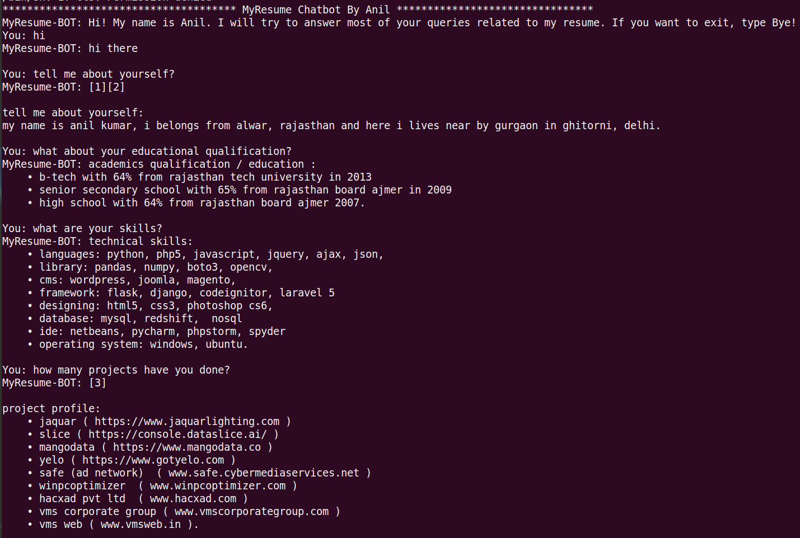

# MyResume-BOT
A simple MyResume chatbot build with Python, NLTK & SKLearn.

## Installation

Installation is simplest:

1. Clone the repository
2. Install dependencies with `pip install -r requirements.txt`

#### Installation notes

MyResume-BOT depends on:
 1. `NLTK`
 2. `SKLearn`

## Usage

Check out A simple usage example for a short intro and about my skills. A sample usage is:

```
python bot.py
```

output is:



## Author

* **Anil Kumar Prajapati** 